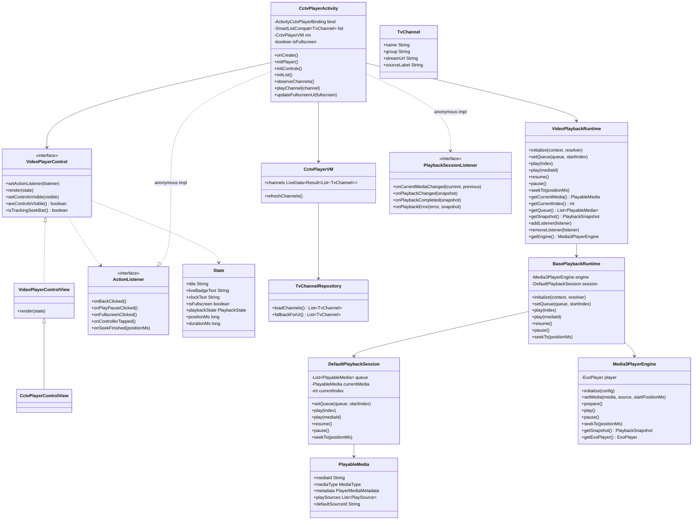
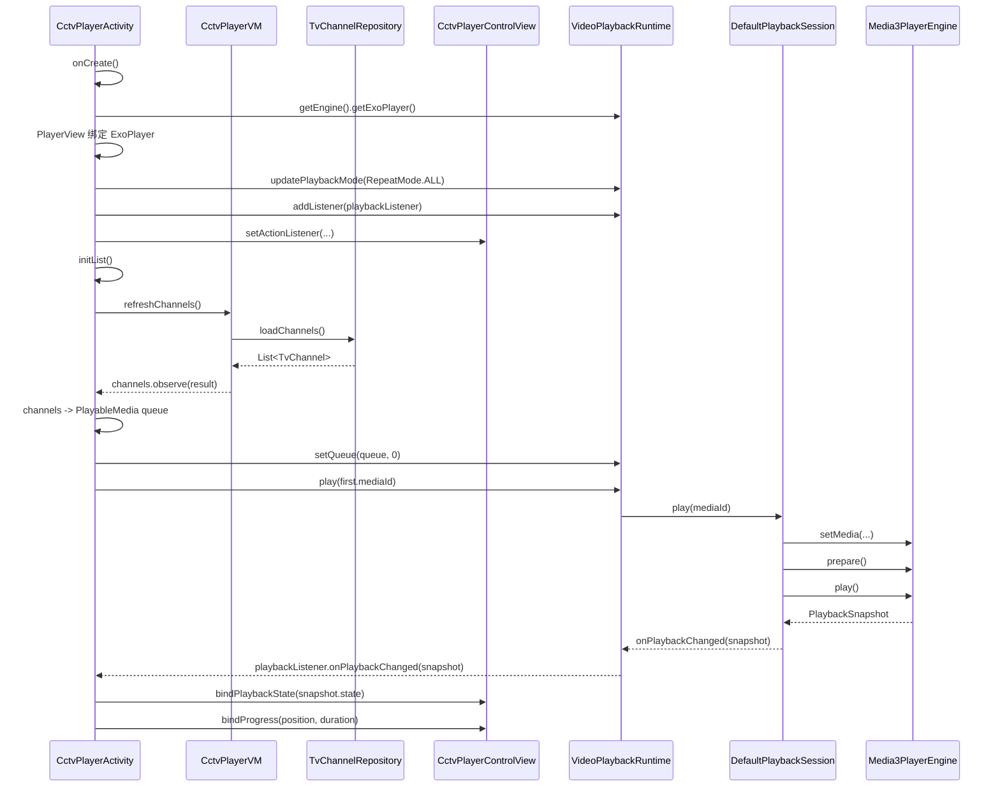
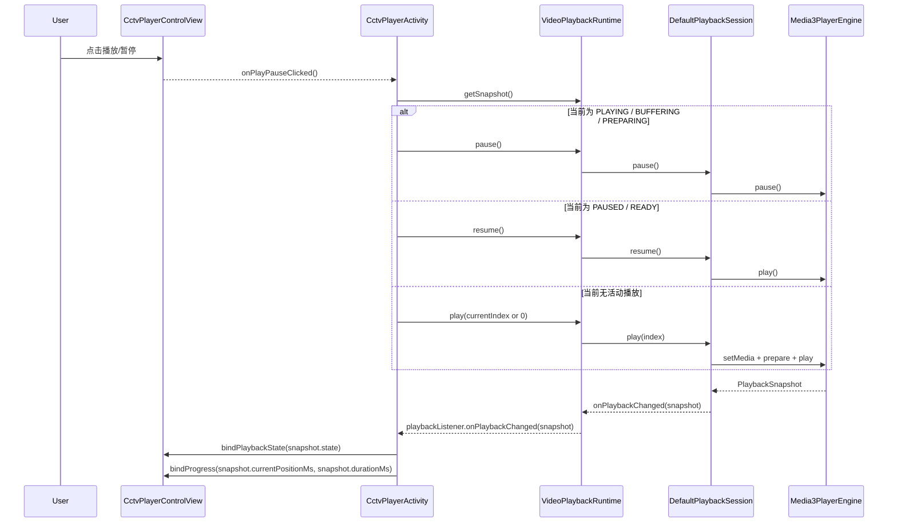
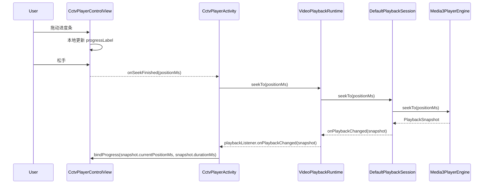

# CCTV Player 架构设计

## 1. 背景

`QPlayer` 中的 `CctvPlayerActivity` 已完成一轮重构，目标有两个：

1. 将播放控制层从 Activity 中抽离，收敛为独立控件。
2. 将页面播放能力切换到 `QPlayer` 自有播放协议与 runtime，而不是页面直接操作 `ExoPlayer`。

这次重构后的核心收益：

- Activity 只负责页面编排、频道列表、全屏切换和状态同步。
- 控制层作为独立 View，可复用、可测试、可替换。
- 播放链路统一走 `VideoPlaybackRuntime -> BasePlaybackRuntime -> DefaultPlaybackSession -> Media3PlayerEngine`。

---

## 2. 设计目标

### 2.1 控制层解耦

播放控制层不再散落在 `CctvPlayerActivity` 中，而是收敛到通用视频控制协议和默认控件实现中。

要求：

- 控件内部管理自己的点击事件和进度条交互
- 通过协议把事件抛给外层
- 暴露状态接口给外层更新 UI

### 2.2 播放能力统一

`CctvPlayerActivity` 不直接创建或控制 `ExoPlayer`，改为复用 `QPlayer` 的统一播放能力。

要求：

- 频道数据先转换成 `PlayableMedia`
- 播放、暂停、恢复、seek、状态监听统一走 `VideoPlaybackRuntime`
- 页面与底层播放内核之间通过 `PlaybackSessionListener` 对接

### 2.3 职责清晰

避免 Activity 既负责 UI 控件细节、又负责播放内核状态机、又负责媒体模型转换。

---

## 3. 模块职责

### 3.1 `CctvPlayerActivity`

职责：

- 承载页面布局
- 初始化播放器视图与 `VideoPlaybackRuntime` 绑定
- 初始化频道列表
- 监听 `CctvPlayerControlView.ActionListener`
- 监听 `PlaybackSessionListener`
- 处理全屏切换、列表选中态、频道切换

不再负责：

- 直接控制 `ExoPlayer`
- 直接维护控制层内部控件逻辑
- 直接维护播放状态图标、进度格式化等细节

### 3.2 `VideoPlayerControl`

职责：

- 抽象通用视频控制协议
- 统一定义控制事件和状态更新入口
- 让不同视频页依赖同一套交互契约，而不是某个具体控件类

### 3.3 `VideoPlayerControlView`

职责：

- 作为 `VideoPlayerControl` 的默认 View 实现
- 封装顶部/底部控制层 UI
- 对外暴露统一事件协议
- 接收统一状态对象并渲染 UI
- 管理控制层显隐动画
- 管理 seek bar 拖动过程中的中间态

### 3.4 `CctvPlayerControlView`

职责：

- 作为 CCTV 场景的兼容命名壳
- 继承通用实现，避免现有页面一次性改名
### 3.5 `VideoPlaybackRuntime`

职责：

- 作为视频场景统一 runtime 入口
- 对页面暴露播放控制与状态查询接口
- 屏蔽底层 session / engine 细节

### 3.6 `BasePlaybackRuntime`

职责：

- 管理 runtime 生命周期
- 创建并持有 `Media3PlayerEngine`
- 创建并持有 `DefaultPlaybackSession`
- 转发 `PlaybackSessionListener`
- 统一处理播放命令

### 3.7 `DefaultPlaybackSession`

职责：

- 管理播放队列
- 管理当前媒体项
- 负责 `PlayableMedia` 的选择与切换
- 驱动 `PlayerEngine` 执行 `prepare/play/pause/seek`

### 3.8 `Media3PlayerEngine`

职责：

- 适配 `ExoPlayer`
- 将底层播放器状态转换成 `PlaybackSnapshot`
- 向 session 回调播放进度、状态、错误、完成事件

### 3.9 `CctvPlayerVM` / `TvChannelRepository`

职责：

- 拉取或回退频道数据
- 通过 `LiveData<Result<List<TvChannel>>>` 推送给页面

---

## 4. 核心类图



---

## 5. 分层架构图

```mermaid
flowchart TD
    subgraph UI["UI 层"]
        A["CctvPlayerActivity"]
        B["VideoPlayerControl"]
        B2["VideoPlayerControlView"]
        B3["CctvPlayerControlView"]
        C["activity_cctv_player.xml"]
        D["widget_cctv_player_controls.xml"]
    end

    subgraph Biz["页面编排层"]
        E["频道列表编排"]
        F["全屏切换编排"]
        G["TvChannel -> PlayableMedia 转换"]
    end

    subgraph Runtime["播放运行时层"]
        H["VideoPlaybackRuntime"]
        I["BasePlaybackRuntime"]
    end

    subgraph Session["播放会话层"]
        J["DefaultPlaybackSession"]
        K["PlaybackSessionListener"]
        L["PlayableMedia"]
        M["PlaybackSnapshot"]
    end

    subgraph Engine["播放内核层"]
        N["Media3PlayerEngine"]
        O["ExoPlayer"]
    end

    subgraph Data["数据层"]
        P["CctvPlayerVM"]
        Q["TvChannelRepository"]
        R["TvChannel"]
    end

    A --> B
    B <|.. B2
    B2 <|-- B3
    A --> C
    B2 --> D

    A --> E
    A --> F
    A --> G

    A --> H
    H --> I
    I --> J
    J --> N
    N --> O

    J --> K
    J --> L
    J --> M
    K --> A

    A --> P
    P --> Q
    Q --> R
    R --> G
    G --> L
```

### 5.1 分层说明

- `UI 层`：负责展示和用户交互，不直接操作底层播放器。
- `页面编排层`：负责把页面动作翻译成播放命令，把播放状态翻译成 UI 状态。
- `播放运行时层`：对外暴露统一播放入口，屏蔽会话层和引擎层细节。
- `播放会话层`：负责队列、当前媒体、播放状态快照和事件回调。
- `播放内核层`：真正适配 `Media3 / ExoPlayer`。
- `数据层`：负责频道列表加载与回退。

其中视频控制层已进一步拆成三层：

- `VideoPlayerControl`：通用协议
- `VideoPlayerControlView`：默认实现
- `CctvPlayerControlView`：场景兼容壳

---

## 6. 页面初始化时序图



---

## 7. 控制层点击播放/暂停时序图



---

## 8. 控制层 Seek 时序图



---

## 9. 状态流说明

### 8.1 UI 状态来源

控制层和页面展示状态统一来自两类来源：

- 页面态
  - `isFullscreen`
  - 当前频道列表
  - 当前频道选中状态
- 播放态
  - `PlaybackSnapshot`
  - `PlayableMedia`

### 8.2 控制层状态更新入口

控制层通过统一状态对象更新 UI：

- `render(state)`
- `setControlsVisible`

这样做的好处是：

- Activity 可以按自己的节奏合并状态更新
- 控件本身不依赖 runtime
- 后续可以复用到其它直播或点播页面
- 页面可以依赖协议而不是依赖具体控件类

---

## 10. 关键设计决策

### 9.1 为什么不在控件里直接持有 `VideoPlaybackRuntime`

因为控件应该只负责“展示和交互”，不负责“业务编排和播放调度”。

如果控件直接依赖 runtime，会带来：

- UI 组件和播放协议强耦合
- 控件复用性差
- 生命周期和状态同步边界不清晰

当前方案由 Activity 做中间协调层，更容易演进。

### 9.2 为什么频道要先转成 `PlayableMedia`

因为 `QPlayer` 的统一协议是 `PlayableMedia`。

好处：

- CCTV 直播、普通视频、音频页都能走一致的播放语义
- 后续可直接扩展清晰度、多 source、headers、DRM、字幕等能力
- 上层业务模型和底层播放协议解耦

### 9.3 为什么复用 `VideoPlaybackRuntime`

因为它已经封装好了：

- 统一播放状态
- 队列管理
- 会话监听
- 与 `Media3PlayerEngine` 的适配

这避免了页面直接和 `ExoPlayer` 绑定，后续更容易做：

- 埋点
- 重试策略
- source resolver
- 多页面统一播放行为

---

## 11. 当前限制与后续演进

### 10.1 当前限制

- `VideoPlaybackRuntime` 是全局单例，多个视频页同时接入时需要更明确的会话隔离策略
- `CctvPlayerControlView` 现在是兼容壳，命名上仍带有场景语义
- `TvChannel -> PlayableMedia` 的转换还放在 Activity 内部，后续可下沉到 mapper

### 10.2 建议的后续演进

1. 引入 `CctvPlaybackCoordinator`
   - 负责 Activity 与 runtime 之间的协调
   - 继续收缩 Activity 体积

2. 抽离 `TvChannelMediaMapper`
   - 将 `TvChannel.toPlayableMedia()` 从 Activity 中移出

3. 推动页面直接依赖 `VideoPlayerControl`
   - 新页面直接接入通用协议
   - 逐步淡化 `CctvPlayerControlView` 的场景命名

4. 为 `VideoPlaybackRuntime` 增加页面级 session token
   - 避免不同页面间互相覆盖队列

---

## 12. 相关文件

- [CctvPlayerActivity.kt](/Users/qinwei/QPlayer/app/src/main/java/com/qw/player/demo/cctv/CctvPlayerActivity.kt)
- [VideoPlayerControl.kt](/Users/qinwei/QPlayer/app/src/main/java/com/qw/player/demo/widget/VideoPlayerControl.kt)
- [VideoPlayerControlView.kt](/Users/qinwei/QPlayer/app/src/main/java/com/qw/player/demo/widget/VideoPlayerControlView.kt)
- [CctvPlayerControlView.kt](/Users/qinwei/QPlayer/app/src/main/java/com/qw/player/demo/widget/CctvPlayerControlView.kt)
- [widget_cctv_player_controls.xml](/Users/qinwei/QPlayer/app/src/main/res/layout/widget_cctv_player_controls.xml)
- [activity_cctv_player.xml](/Users/qinwei/QPlayer/app/src/main/res/layout/activity_cctv_player.xml)
- [VideoPlaybackRuntime.kt](/Users/qinwei/QPlayer/app/src/main/java/com/qw/player/demo/runtime/VideoPlaybackRuntime.kt)
- [BasePlaybackRuntime.kt](/Users/qinwei/QPlayer/app/src/main/java/com/qw/player/demo/runtime/BasePlaybackRuntime.kt)
- [DefaultPlaybackSession.kt](/Users/qinwei/QPlayer/player-core/src/main/java/com/qw/player/core/session/DefaultPlaybackSession.kt)
- [Media3PlayerEngine.kt](/Users/qinwei/QPlayer/player-media3/src/main/java/com/qw/player/media3/Media3PlayerEngine.kt)
